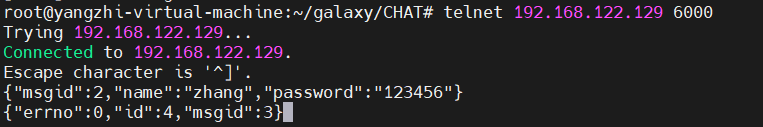
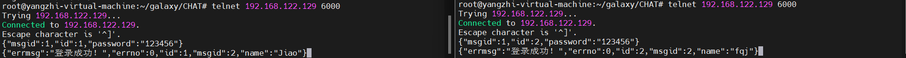
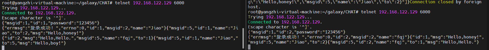
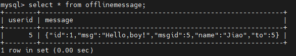
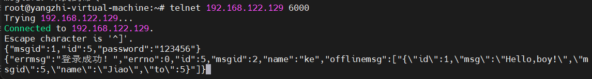
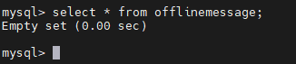

# 基于 muduo 网络库的C++实现集群聊天服务器


## 编译方式
- 1.清除build和bin旧文件
- 2.自动编译生成新文件
```bash
./mk.sh
```


## 注册登录业务
- 成功编译在bin下生成新ChatServer执行文件
- 客户端登录服务器
```bash
./ChatServer
```
- 开启监听客户端连接
```bash
telnet 127.0.0.1 6000
```
- 使用zhang的账号来注册,客户端键入
```bash
 {"msgid":2,"name":"zhang","password":"123456"}
```



- 使用zhang的账号来登录,客户端键入
```bash
{"msgid":1,"id":1,"password":"123456"}
```


## 私聊业务
1. 使用两个账户登录聊天服务器
```bash
{"msgid":1,"id":1,"password":"123456"}
{"msgid":1,"id":5,"password":"123456"}
```


2. 发送消息
```bash
{"msgid":5,"id":1,"name":"Jiao","to":2,"msg":"Hello,honey!"}
{"msgid":5,"id":2,"name":"fqj","to":1,"msg":"Hello,Hello."}
{"msgid":5,"id":1,"name":"Jiao","to":5,"msg":"Hello,boy!"}
```
    id=1用户向id=2用户进行私聊，发送消息为「Hello,honey!」
    id=2用户向id=1用户进行私聊，发送消息为「Hello,Hello.」
    id=1用户向id=5用户(offline user)进行私聊，发送消息为「Hello,honey!」


3. 离线消息存储入`offlinemessage`数据库


4. id=5用户登录，id=1发来的离线消息被成功推送，底层数据库`offlinemessage`清空




## 文件布局

```
bin/
|-- ChatServer          # 可执行文件 ChatServer
|-- ChatClient          # 可执行文件 ChatClient

src/
|-- client/             # 存放客户端相关源文件
|   |-- main.cpp
|   |-- CMakeLists.txt
|-- server/             # 存放服务器相关源文件
|   |-- db/             # 存放数据库增删改查代码源文件
|   |   |-- db.cpp      
|   |-- model/          # 存放数据库模型相关的源文件
|   |   |-- friendmodel.cpp 
|   |   |-- groupmodel.cpp 
|   |   |-- offlinemessagemodel.cpp
|   |   |-- usermodel.cpp
|   |-- redis/          # 存放与 Redis 相关的源文件
|   |   |-- redis.cpp
|   |-- chatserver.cpp 
|   |-- chatservice.cpp 
|   |-- main.cpp        # 服务器端主程序入口文件
|   |-- CMakeLists.txt
|-- CMakeLists.txt      # 项目的 CMake 构建配置文件

include/                # 存放项目的头文件，布局与 src 类似

text/                   # 存放测试用的代码文件

thirdparty/             # 存放第三方库
|-- json/               # JSON 库的头文件
|   |-- json.hpp
```

## MySQL常用指令
### 启动和停止MySQL服务
```
net start mysql // 启动mysql服务
net stop mysql // 停止mysql服务
```
### MySQL的登陆和退出
- MySQL登陆
```base
mysql -u root -p
123456
```
- MySQL登出
```base
exit
quit
```
### 查询数据库
查询所有的数据库
```base
SHOW DATABASES;
```
### 使用数据库
- 使用数据库,SQL是区分大小写的！
```base
USE DatabaseName;
```
### 查询表
- 查询当前数据库下所有表名称
```base
SHOW TABLES;
```
- 查询表结构
```base
DESC TableName;
```